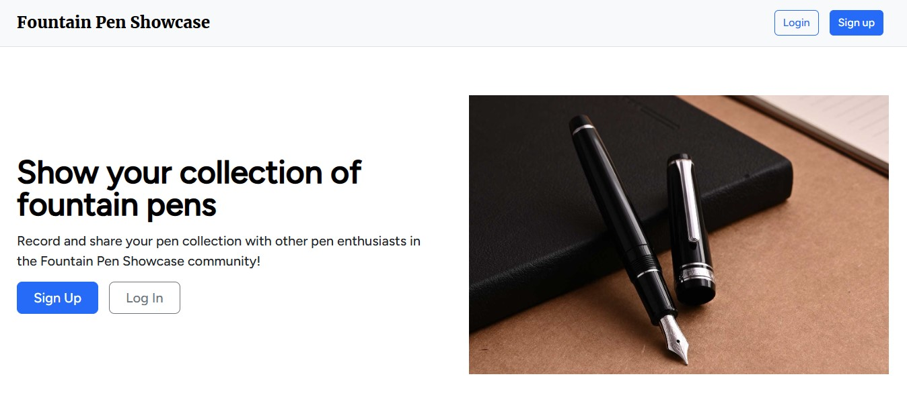

# Fountain Pen Showcase

Fountain Pen Showcase is a web app where fountain pen enthusiasts can upload and share their pen collection. Users can sign up, add information and an image for each fountain pen they own, then share their public profile with others using a unique link. Users can also customize their profile picture and profile description.

User profiles are public and do not require sign-up (e.g. [https://fountainpenshowcase.com/profile/jcstlo/](https://fountainpenshowcase.com/profile/jcstlo/)). Clicking on a specific pen will show more information.

# Technical Details

* Full-stack app built in Python with Django
* Frontend is styled with Bootstrap 5
* User data is stored in PostgreSQL, using Django ORM
* User-uploaded images are stored in Amazon S3
* Uses Docker to configure and deploy different environments (local, demo, production)
* Deployed on DigitalOcean VPS with Gunicorn and nginx, with SSL/TLS

# First start up (local development)

* `docker compose up -d --build`
* `docker compose exec web python manage.py migrate`
* `docker compose exec web python manage.py createsuperuser` (for admin use)
* `docker compose exec web python manage.py test` (for running tests)

# Production deployment steps (with HTTPS)

## Prerequisites:

* You own a domain name
* A running Linux VPS with Docker and Docker Compose (e.g. DigitalOcean droplet)

## Steps

* Copy the sample docker-compose file with `cp docker-compose-prod-sample.yml docker-compose-prod.yml`
  * In `docker-compose-prod.yml`, replace environment variables that have `__REPLACE_ME__`
* Start the containers
  * Run `docker compose -f docker-compose-prod.yml up -d --build` to start the containers
  * Run `docker compose exec web python manage.py migrate` to run database migrations
  * Run `docker compose exec web python manage.py collectstatic` to collect all static assets for nginx to server
* Check if the website is available at `https://<domain_name_here>`
  * Note that `ACME_CA_URI` environment variable is using Let's Encrypt's staging environment, so an error ("Your connection is not private") is expected
    * Click on "Advanced" and then on "Proceed"
  * Try creating a new user, uploading a picture, and checking if static assets load properly
* Once the step above is confirmed, you can now switch to Let's Encrypt's production environment
  * NOTE: Let's Encrypt has [rate limits](https://letsencrypt.org/docs/rate-limits/) that you should be aware of.
  * Run `docker compose -f docker-compose-prod.yml down`
  * Run `docker volume prune -a`
  * Comment out the line with `ACME_CA_URI` in `docker-compose-prod.yml`
  * Run `docker compose -f docker-compose-prod.yml up -d --build` to start the containers
* Re-run the `migrate` and `collectstatic` commands from earlier, since all the volumes were pruned
* The website should now be available at `https://<domain_name_here>`!